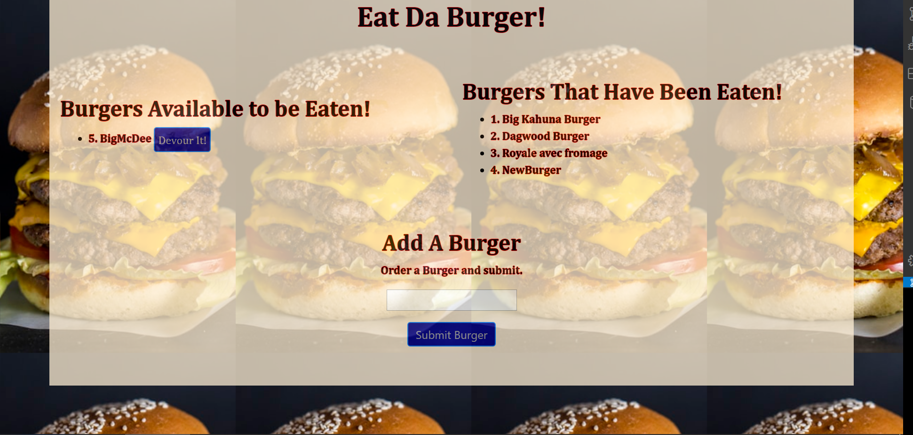

## Note Taker with Express
Note taking application with local storage.

        

## Description
This application takes a burger order and either shows it as available or eaten. The application reders dynamic html using handlebars and saves the data using a mysql table
        
# Table of contents
1. [Installation](#installation)
2. [Usage](#usage)
3. [License](#license)
4. [Contributing](#contributing)
5. [Tests](#tests)
6. [Questions](#questions)

## Installation <a name="installation"></a>
The following dependencies need to be installed

```
npm i express-handlebars, express, mysql
```
Additionally, must run on chrome, with file structure as follows:
root
    config
        connection.js
        orm.js
    controllers
        burgers_controllers.js
    db
        schema.sql
        seeds.sql
    models
        burger.js
    node_modules
    package.json
    public
        assets
            css
                styles.css
            img
                burger.png
    views
        index.handlebars
        layouts
            main.handlebars
    server.js

## Usage <a name="usage"></a>
Ordering burgers should be fun.  This application demonstrates how this can be done with a sql and handlebars enabled html order screen.

## License <a name="license"></a>
None.

## Contributing <a name="contributing"></a>
None
        
## Tests <a name = "tests"></a>

```
none

```

## Questions <a name ="questions"></a>
 

If you have an questions about the repo, open an issue or contact [randrmoel](https://api.github.com/users/randrmoel)
at my email: robert.moel@rvmconsulting1.com
